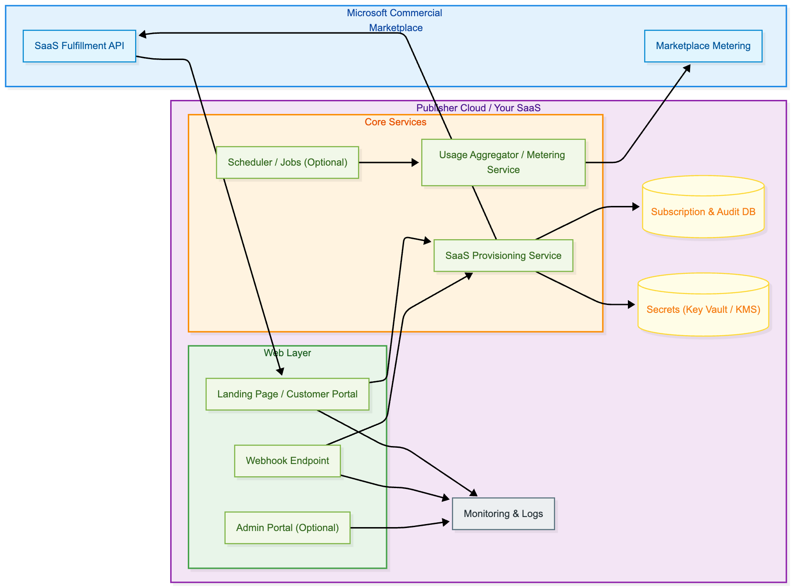
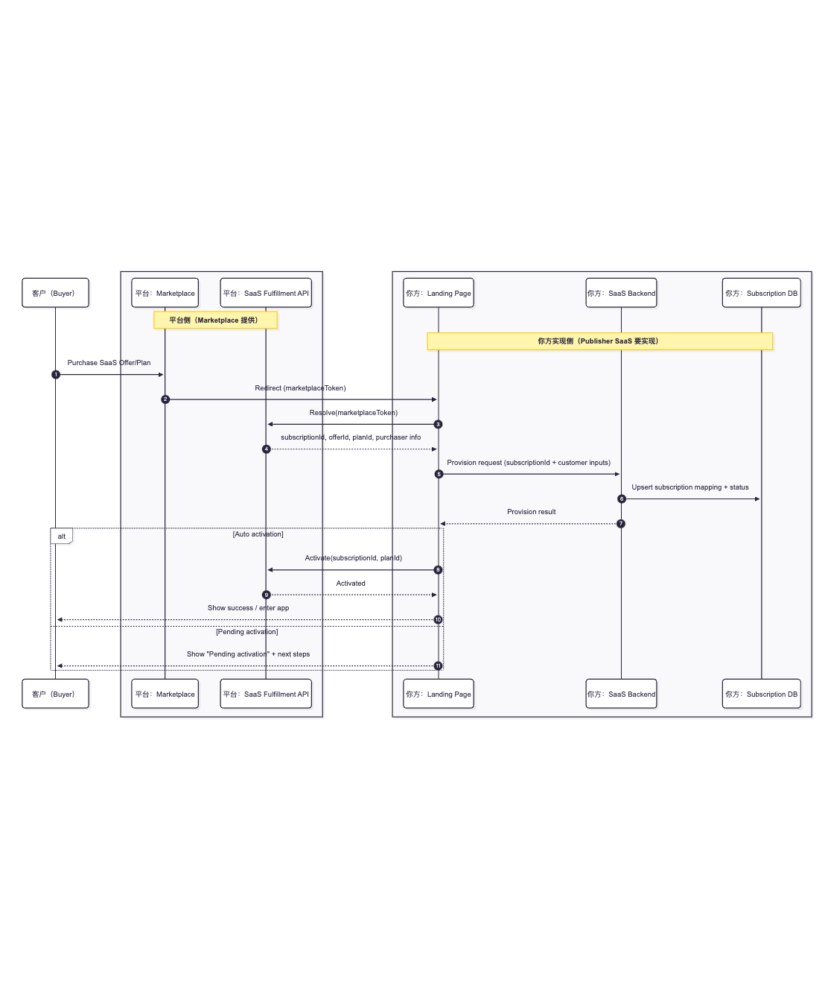
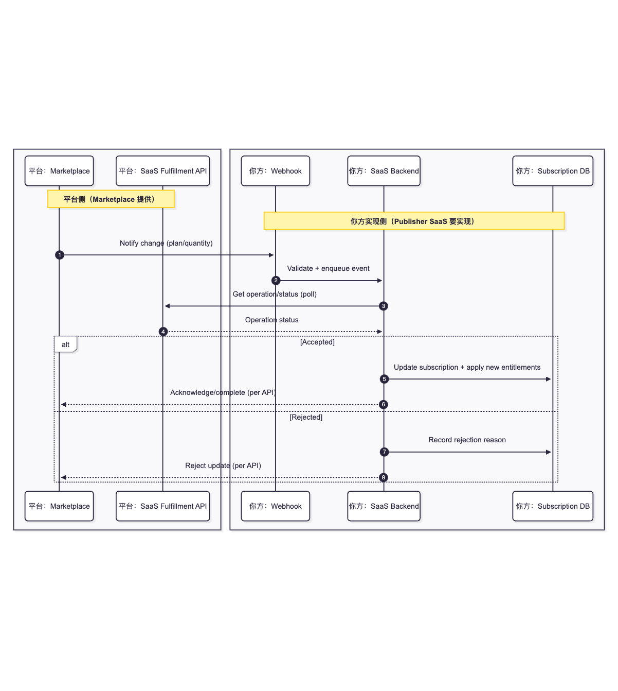
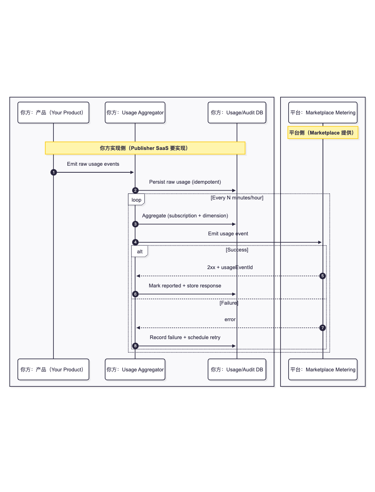

# Azure Marketplace (Microsoft Commercial Marketplace) SaaS Listing Implementation Guide

> Goal: break down "listing a SaaS application on Azure Marketplace" into executable work items, API inventory, data models, and acceptance criteria, so the team can implement and estimate effort.
>
> Scope: technology-stack agnostic (.NET / Java / Node.js / Python / Go / any). This repository uses the official reference implementation [**SaaS Accelerator Repo**](https://github.com/Azure/Commercial-Marketplace-SaaS-Accelerator) as a baseline and abstracts common patterns.

- 中文版 / Chinese: [README.md](./README.md)
- API reference: [API_REF_EN.md](./API_REF_EN.md)

---

## 1. What you need to build (one-sentence version)

After a customer purchases your SaaS Offer in Azure Marketplace, Marketplace redirects the customer to your **Landing Page**. Your service must:

- Identify and parse the Marketplace return token (`marketplace token`), and call the **SaaS Fulfillment API** to resolve subscription details
- Create/bind the customer tenant and subscription inside your SaaS platform (Provision)
- Call **Activate** at the right time to start billing (or keep it in PendingActivation for manual/asynchronous approval)
- Handle subsequent subscription events: plan change, quantity change, cancellation, etc. (typically Webhook + polling as a safety net)
- (Optional) Implement metered billing: report usage events to **Marketplace Metering**

In the SaaS Accelerator reference, these capabilities are commonly split into:

- Customer portal / Landing page (CustomerSite): receive token, collect inputs, trigger activation, etc.
- Publisher admin portal (AdminSite): manage subscriptions, changes, manual usage reporting, logs, config, etc.
- Service layer (Services) and data access layer (DataAccess)
- (Optional) scheduled reporting (MeteredTriggerJob / Scheduler Manager)

---

## 2. Concepts & key decisions (clarify early to avoid rework)

### 2.1 Offer shape & billing model

- **SaaS Offer (Transactable)**: Marketplace owns subscription + billing entry; you own service delivery and lifecycle management.
- Common billing combinations:
  - Subscription-only (monthly/yearly, etc.)
  - Per-seat (Quantity/Seat)
  - Subscription + Metered dimensions

Key decisions:

1) Do you need **metered billing**? If yes, you must implement usage aggregation/deduplication/retry/audit.
2) Do you need **manual/asynchronous activation**? (Purchase -> PendingActivation -> you activate later)
3) Do you support **subscription updates** (plan/quantity changes)? If yes, define accept/reject rules and idempotency.

### 2.2 Minimal required capabilities (MVP)

- Landing page integration + Resolve
- Persist subscription records (or at least make them queryable/traceable)
- Activate (or PendingActivation + backend activation)
- Unsubscribe / Deprovision
- Security: secrets management, RBAC, audit logs

---

## 3. Reference architecture (replaceable with any language/deployment)

### 3.1 Logical component diagram (recommended)



### 3.2 Runtime boundaries & responsibilities

- **Marketplace**: initiates purchase, hosts subscription, redirects, provides Fulfillment/Metering APIs
- **Your SaaS platform**:
  - Map Marketplace subscription to your internal tenant/account
  - Enable/disable service, enforce quotas and policies
  - Compute and report usage (if metered)
  - Auditing, alerting, compliance (security/privacy/availability)

---

## 4. Partner Center work (product/config)

> Typically done by the product/business/publishing owner + engineering owner together. Treat the Partner Center config items as a checklist to avoid missing anything before go-live.

### 4.1 Prerequisites: account & publishing permissions

- Partner Center account, publisher verification, tax/payout profile
- Choose SaaS Offer type, define Offer ID / Plan ID (these will enter your code and data model)

### 4.2 Define Plans, billing periods, (optional) metered dimensions

- Subscription plans: name, period, price, per-seat or not
- Metered dimensions (optional): dimension name, unit, caps, etc.

### 4.3 Technical configuration

You typically need to provide:

- **Landing Page URL** (redirect target after purchase)
- **Webhook / Notification URL** (endpoint for subscription change notifications)
- **Entra ID / AAD config** (Tenant ID / App ID / Secret, depending on auth mode)

#### 4.3.1 Required: Register an application in Microsoft Entra ID (App Registration)

This step is **required** for both **SaaS Fulfillment APIs / Marketplace Metering APIs**:

- When your backend calls Fulfillment/Metering APIs, you must send `Authorization: Bearer <access_token>`. The token is obtained via **client credentials** using your Entra app registration.
- Your webhook endpoint must also be able to receive and validate `Authorization: Bearer <jwt>` sent by Microsoft (JWT validation must match the Entra Tenant/App info you configured in Partner Center Technical configuration).

Minimum items you need in practice:

1. Create an App Registration in your Entra tenant (single-tenant recommended)
2. Create a `client secret` or configure a certificate (certificate recommended; secrets must be rotatable)
3. **Create the service principal (Enterprise Application) for the Marketplace SaaS API resource in the same Entra tenant** (this is commonly missed)

   - Fixed resource ID: `20e940b3-4c77-4b0b-9a53-9e16a1b010a7`
   - Purpose: ensure the corresponding Enterprise Application (service principal) exists in your tenant, so you can request and use access tokens for Fulfillment/Metering.
   - Azure CLI example:

    ```bash
    az login --tenant <TENANT_ID>
    az ad sp create --id 20e940b3-4c77-4b0b-9a53-9e16a1b010a7
    ```

4. The `scope` for token acquisition is fixed to: `20e940b3-4c77-4b0b-9a53-9e16a1b010a7/.default`
5. Fill Entra Tenant ID / App ID etc. into Partner Center Technical configuration (used for webhook `aud/tid` validation and platform identification)

Official guide (strongly recommended to align with):

- [Register a SaaS application](https://learn.microsoft.com/partner-center/marketplace-offers/pc-saas-registration)

> SaaS Accelerator deployment scripts can create the required App Registration and write values to config/database. Your implementation can use IaC/scripts or manual configuration; the important part is that values are consistent and rotatable.

---

## 5. Authentication & secrets (must be implemented properly)

### 5.0 Marketplace identity vs SaaS identity (do not mix)

- **Marketplace side (purchase & billing)**: customer purchases in Azure/Commercial Marketplace using their Microsoft Entra ID. Subscription & billing belong to the customer tenant and billing system.
- **Your API caller identity (required)**: your backend uses your own Entra app registration (client credentials) to call Fulfillment API / Metering API.
- **SaaS product identity (your users)**: up to you (built-in accounts, Entra/3rd-party SSO, B2C, etc.).

Principle: never treat any Landing Page URL parameters as an authoritative subscription identity. The authoritative subscription identity is the `subscriptionId` (and offer/plan) obtained by calling Fulfillment **Resolve** using the `marketplace token`. Persist the mapping between `subscriptionId` and your internal tenant/account with full audit.

### 5.1 Two common app identities you may need

1) **Service identity for calling Fulfillment/Metering APIs**
- Backend uses client credentials
- Least-privilege permissions

2) **Login identity for customer access to your Landing/Portal** (optional but strongly recommended)
- Used when customers enter "Manage Account" / Landing and log into your SaaS
- Multi-tenant vs single-tenant depends on your business

### 5.2 Secrets management & rotation

- Store client secrets/certificates in Key Vault (or equivalent KMS); never in repo/plain config
- Recommendations:
  - Prefer certificates over long-lived secrets (if your team is ready)
  - Implement rotation: overlap window, rollback, expiry monitoring

---

## 6. Required interfaces & flows (broken down by lifecycle)

> This chapter is the core for engineering estimation; each subsection can be turned into backend/frontend/ops task cards.

### 6.1 Post-purchase redirect: Landing Page (required)

**Input**: Marketplace redirects the user’s browser to your Landing Page URL configured in Partner Center, and includes the `marketplace token` used to resolve the subscription (exact parameter name/transport depends on official docs and real redirect behavior).

**About “custom parameters” (where they come from and why they matter)**

- **Source**: the Landing Page URL you set in Partner Center (query string/path fragments you pre-fill), plus your own routing rules. Marketplace appends the `marketplace token` on top of that URL.
- **Example**:
  - Landing Page URL configured in Partner Center:
    - `https://saas.contoso.com/landing?env=prod&region=cn&channel=marketplace`
  - Actual redirect after purchase (illustrative):
    - `https://saas.contoso.com/landing?env=prod&region=cn&channel=marketplace&token=<marketplaceToken>`
  - `env/region/channel` are your custom params; `token` is appended by Marketplace (exact parameter name/transport may differ).
- **Purpose**: environment/region/channel routing, staged rollout, A/B, logging tags, etc. For example `env=prod`, `region=cn`, `channel=marketplace`, `offerAlias=xxx`.
- **Boundary**: custom params are only for “site behavior/context”, not subscription identity. The authoritative identity must come from Fulfillment Resolve (`subscriptionId` + offer/plan), derived from the marketplace token.

**Implementation notes**

- Treat all URL parameters as untrusted input: whitelist allowed keys and values to avoid switching to wrong environment/tenant.
- Do not put sensitive info in URL custom params (internal tenant IDs, secrets, DB identifiers, etc.).
- Logging: it’s OK to tag logs with custom params for troubleshooting/statistics, but don’t store them as the subscription’s identity.

**What you need to do**:

1) Validate the request basics (HTTPS, presence of required params)
2) Call Fulfillment **Resolve** using the token to get: subscriptionId, offerId, planId, purchaser info, etc.
3) In your system:
   - Create/bind customer tenant (tenant/account)
   - Create subscription record
   - Persist Marketplace subscription -> internal mapping
4) Guide the customer:
   - If you need extra input (admin email, region, instance name), collect here
   - Continue into auto-provisioning or pending-activation flow

Recommended minimum data to persist:

- marketplaceSubscriptionId / subscriptionId (GUID)
- offerId, planId, quantity
- purchaser tenant/user identifiers (if available)
- state machine: PendingFulfillmentStart / PendingActivation / Active / Suspended / Unsubscribed …
- timestamps and audit logs

### 6.2 Resolve (required)

**Purpose**: resolve marketplace token into a durable subscription entity.

Key points:

- The purchase token is only for initial resolution; do not treat it as a long-term credential
- Resolve should be idempotent: multiple hits with the same token should not create duplicates

### 6.3 Provision (required)

**Purpose**: actually provision service in your SaaS platform.

Define what “provisioning” means in your product:

- Create tenant space, initialize configs, allocate resources, create default admin, etc.
- Handle failures: retry / rollback / manual intervention

### 6.4 Activate (usually required; or keep PendingActivation)

**Purpose**: tell Marketplace to start billing.

Two modes:

- **Auto-activate**: call Fulfillment Activate immediately after Provision succeeds
- **Manual/async activate**: mark PendingActivation, and activate later after admin review or async job completes

> SaaS Accelerator supports toggling auto-activation via configuration.

### 6.5 Webhook: subscription updates & cancellation (strongly recommended)

Marketplace may notify on:

- Change Plan (upgrade/downgrade)
- Change Quantity (per-seat)
- Suspend / Reinstate
- Unsubscribe

Implementation guidelines:

- **Verify webhook**: signature/JWT validation (per official mechanism)
- **Idempotency**: events may be replayed
- **Async processing**: quickly ACK and enqueue actual work
- **Polling safety net**: periodically query fulfillment status to avoid missing notifications

### 6.6 Operations polling (for async changes)

Plan/quantity changes are typically async:

- Fulfillment returns operationId / operation-location
- You poll until the operation is succeeded/failed

### 6.7 Unsubscribe / Deprovision (required)

**Goal**: when customers cancel, stop billing and resource usage correctly.

Typical actions:

- Disable service, reclaim quota, retain data per your retention policy
- Update internal state and audit

---

## 7. Metered billing capability (optional, but significant effort)

### 7.1 The “usage pipeline” you need

- Collect: product events/logs/meter points
- Aggregate: subscription + dimension + time window
- Deduplicate: no double-billing for the same business event
- Report: call Marketplace Metering API
- Audit: record request/response/retry/error reasons
- Compensate: retries, dead-letter queue, manual replay

### 7.2 Reporting strategy recommendations

- **Small-batch reporting**: aggregate hourly/daily to avoid huge payloads
- **Idempotency key**: construct a traceable unique key per usage event (e.g., business event ID)
- **Failure handling**:
  - Retriable: backoff retry
  - Non-retriable: alert + manual queue

> SaaS Accelerator provides manual reporting and a Scheduler Manager (fixed usage) as reference.

---

## 8. Key sequence diagrams (for design review/estimation)

See: [API_REF_EN.md](./API_REF_EN.md) (Chinese reference: [API_REF.md](./API_REF.md))

### 8.1 First entry after purchase (Resolve + Provision + Activate)



### 8.2 Subscription update (Plan/Quantity)



### 8.3 Metered usage reporting (Usage Events)



---

## 9. Suggested data model (minimum for audit & troubleshooting)

> You can use SQL or NoSQL; strongly recommended to support query and auditing.

Suggested minimum tables/collections:

- `Subscriptions`
  - subscriptionId (Marketplace)
  - internalTenantId / accountId
  - offerId / planId / quantity
  - status (enum + timestamps)
- `Plans` (synced from Partner Center or maintained manually)
- `Operations` (operationId for plan/quantity changes, status, error)
- `UsageEvents` (raw + aggregated + reported states)
- `AuditLogs` (key actions, request/response summary, actor)

---

## 10. Non-functional requirements (go-live bar)

### 10.1 Security

- All endpoints must be HTTPS; enforce HSTS
- Webhook must be authenticated/verified
- Least privilege: identities and RBAC for Fulfillment/Metering
- Tenant isolation (data, permissions, log access)

### 10.2 Observability

- Unified `correlationId` / `requestId` across Landing -> backend -> Marketplace API
- Monitor:
  - Resolve/Activate/Webhook success rate and latency
  - Metering report failure rate and retry backlog
  - abnormal subscription states (stuck Pending)

### 10.3 Availability & idempotency

- Resolve/Provision/Activate/Webhook must be retry-safe
- Key writes should use upsert + unique indexes to prevent duplicates

---

## 11. End-to-end implementation steps (milestone-based)

### Milestone A: preparation & design (1–2 weeks, varies by org maturity)

- A1. Confirm Offer/Plan/billing model (metered? seat?)
- A2. Design subscription state machine and idempotency
- A3. Define contracts: Landing Page, Webhook, admin API
- A4. Define data model and audit fields

Deliverables:

- Architecture + sequence diagrams (you can reuse this repo)
- API inventory and schema (OpenAPI/Swagger)
- Data model (ERD or migrations)

### Milestone B: core flow (Resolve -> Provision -> Activate) (2–4 weeks)

- B1. Landing page: receive token and guide customer
- B2. Fulfillment Resolve: obtain subscriptionId
- B3. Persist subscription mapping + idempotency (repeat visits/replays)
- B4. Provision logic (tenant creation, initialization)
- B5. Activate or PendingActivation

Acceptance:

- Complete a test purchase end-to-end to Active (or PendingActivation with manual activation)

### Milestone C: updates & cancellation (2–3 weeks)

- C1. Webhook: auth, idempotency, enqueue
- C2. Plan/Quantity change: operation polling, accept/reject policies
- C3. Unsubscribe: disable/reclaim/retention policy
- C4. Polling safety-net job

Acceptance:

- In a test environment, complete plan upgrades/downgrades, seat changes, and unsubscribe

### Milestone D: metered (optional, 2–6 weeks, highly variable)

- D1. Dimension design and Partner Center configuration
- D2. Product usage capture points
- D3. Aggregation/dedup/retry/audit
- D4. Scheduler (optional)

Acceptance:

- Stable usage reporting (retries, alerts, audit)

### Milestone E: go-live readiness (1–3 weeks)

- E1. Security review (secrets, permissions, tenant isolation, webhook protection)
- E2. Monitoring/alerting and runbooks
- E3. Load test / failure drills (retry storms, API throttling, DB failures)
- E4. Production rollout and rollback plan

---

## 12. Effort breakdown reference (for estimation)

> Actual effort depends on: whether you already have a SaaS platform/tenant model, whether metered is required, multi-region/HA needs, etc.

| Module | Work | Typical complexity | Notes |
|---|---|---:|---|
| Partner Center config | Offer/Plan/technical config/test purchases | Medium | Often not purely engineering; requires cross-checking |
| Identity & secrets | App reg, permissions, Key Vault, rotation | Medium | Common late-stage blocker |
| Landing + Resolve | token handling, Resolve, parameters, idempotency | Medium | MVP critical path |
| Provision/Deprovision | enable/disable tenant resources | High | most coupled to your product |
| Activate/state machine | auto/manual activation, transitions | Medium | requires strong audit |
| Webhook + polling | auth, queueing, idempotency, compensation | High | production stability critical |
| Plan/Quantity changes | polling, accept/reject rules | Medium-High | business rules vary |
| Metered | capture/aggregate/dedup/report/retry | High | widest complexity range |
| Monitoring/alerts | metrics/logs/alerts/runbooks | Medium | determines ops cost |

---

## 13. Acceptance checklist (must pass before go-live)

### 13.1 Functional

- [ ] Test purchase can reach Landing and Resolve successfully
- [ ] Provision is idempotent (re-entry does not create duplicate tenant/subscription)
- [ ] Activate succeeds (or PendingActivation + manual activation works)
- [ ] Plan change works end-to-end (accept and reject paths)
- [ ] Quantity change works (if per-seat is enabled)
- [ ] Unsubscribe cancels and deprovision closes the loop
- [ ] (Metered) usage reporting meets success rate, retryable, auditable

### 13.2 Non-functional

- [ ] Webhook auth/verification passes security review
- [ ] Secrets not stored in code/plain config; rotation drill completed
- [ ] Key flows have observability (logs/metrics/alerts)
- [ ] Runbook exists (Marketplace API outage/throttling/DB failures)

---

## 14. Mapping to SaaS Accelerator (for readers to cross-reference)

[SaaS Accelerator Repo](https://github.com/Azure/Commercial-Marketplace-SaaS-Accelerator)

- Customer / Landing reference: `src/CustomerSite`
- Publisher / Admin Portal reference: `src/AdminSite`
- Fulfillment/Metering client wrappers and business logic: `src/Services`
- Persistence (subscriptions/plans/audit): `src/DataAccess`
- Metered reporting examples: `src/MeteredTriggerJob`
- Deployment scripts: `deployment/Deploy.ps1`, `deployment/Upgrade.ps1`

> You do not need to replicate the exact project structure; keeping layers like “entrypoints (Landing/Webhook) – business – persistence – jobs/scheduling – observability” is recommended.

---

## 15. Official references

- SaaS offer overview and creation:
  - https://learn.microsoft.com/azure/marketplace/partner-center-portal/create-new-saas-offer
- SaaS Fulfillment API (v2):
  - https://learn.microsoft.com/azure/marketplace/partner-center-portal/pc-saas-fulfillment-api-v2
- Marketplace Metering Service API:
  - https://learn.microsoft.com/azure/marketplace/partner-center-portal/marketplace-metering-service-apis
- Metering FAQ:
  - https://learn.microsoft.com/azure/marketplace/partner-center-portal/marketplace-metering-service-apis-faq
