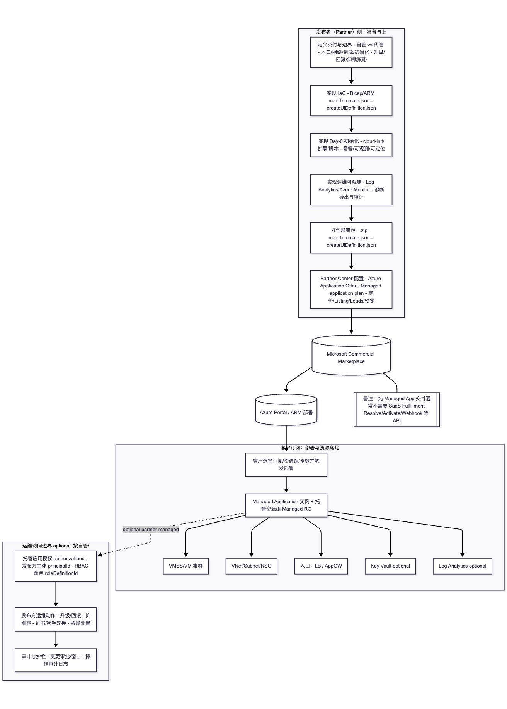

# Managed application offer（部署到客户订阅：托管 VM 集群/VMSS 应用）：发布者要做的事

> 目标：把“上架一个**托管在客户订阅内的 VM 集群应用**（典型落地为 VM Scale Set 或多台 VM + 网络/负载均衡/存储）”在 **Partner Center + 技术实现** 侧需要完成的工作整理成可执行清单。
>
> 适用：你的产品交付必须在客户订阅里创建 IaaS 资源（VMSS/VM、VNet、LB/AppGW、Disk、Key Vault、Log Analytics 等），并希望通过 Marketplace 提供可交易（transactable）的部署体验。

核心前提：

- **SaaS Fulfillment API** 只管订阅生命周期（Resolve/Activate/Webhook/Operations），**不提供**对客户订阅的 ARM 授权。
- “部署到客户订阅”的官方对齐路径通常是 **Azure Application offer 的 Managed application plan（托管应用计划）**。
- 对 VM 集群交付而言，模板与 Day-0 初始化（镜像/扩展/脚本）做不好，会导致认证、部署成功率、可运维性都受影响。

官方参考（建议上架前统一对齐文档口径）：
- Plan Azure Application offer：https://learn.microsoft.com/partner-center/marketplace-offers/plan-azure-application-offer
- Plan managed application plan：https://learn.microsoft.com/partner-center/marketplace-offers/plan-azure-app-managed-app

相关仓库文档：
- Managed application plan 通用清单（含 ACI 示例）：见 [managed-app-offer.md](./managed-app-offer.md)

---

---
## 1. 先定义你要交付什么（可验收项）

把“客户订阅内会出现什么资源、它们如何工作、怎样算交付完成”写成验收项，能显著减少模板/参数/UI 定义反复返工。

### 1.1 典型资源拓扑（示例，不强制）

- **计算（集群）**：
  - 首选：`VM Scale Set (VMSS)`（建议明确 Uniform/Flexible 模式取舍）
  - 或：多台 `Virtual Machine`（需补齐扩缩容/滚动升级策略）
- **入口**：
  - `Standard Load Balancer`（四层）或 `Application Gateway`（七层）
  - 公网/私网入口（是否需要私网化、是否允许公网 IP）
- **网络**：`VNet + Subnet + NSG`，可选 `Private Endpoint`
- **身份与密钥**：`Managed Identity` + `Key Vault`（强烈建议）
- **观测**：`Log Analytics Workspace + Azure Monitor`（至少日志）
- **存储**：`Managed Disks`（数据盘/日志盘）、或 `Storage Account`（可选）

### 1.2 对 VM 集群交付必须提前定的决策

- **镜像策略**：
  - 方案 A：使用 Marketplace/平台镜像（最简单，但要考虑依赖安装与启动耗时）
  - 方案 B：发布方维护自定义镜像（如 Azure Compute Gallery/SIG），模板里引用（部署更稳定，但镜像供应链要治理）
- **初始化策略（Day-0）**：
  - cloud-init / Custom Script Extension / VM Applications 等
  - 脚本幂等、可重入、失败回滚、日志落盘
- **可用性**：
  - 是否需要 Availability Zones（跨区）
  - 单实例是否可接受
- **升级**：
  - 通过镜像版本/扩展版本滚动更新？
  - 是否支持蓝绿/金丝雀？失败如何回滚？
- **卸载**：
  - 客户卸载 managed app 时资源删除/保留策略（尤其是数据盘/存储）

---

## 2. Partner Center 侧：发布者要做的事（清单）

> 这部分通常由产品/商务/发布负责人 + 技术负责人共同完成。建议把每一条做成工单，并标注 owner 与验收标准。

### 2.1 创建 Offer

- Partner Center → Marketplace offers → New offer → **Azure Application**
- 定义 `Offer ID`、`Offer alias`（创建后 ID 不可改）

### 2.2 定义 Plan（至少一个）

- Plan 类型选择：**Managed application**
- 定义 Plan ID/Plan name、受众（public/private）、可用区域

### 2.3 定价与交易模型（必须提前对齐）

Managed application plan 支持 Marketplace 交易，但定价口径经常被误用。你需要明确：

- Marketplace 上你到底卖什么：
  - 托管/运维服务费（management fee）？
  - 软件订阅费？
  - 是否叠加按量计费？

常见形态：

- **Azure Application 负责“客户订阅内一键部署与受控运维”**
- 若还需要“软件订阅费/Seat/按量”，很多团队会用 **SaaS offer** 承载订阅计费，Azure Application 只承载交付。

### 2.4 Listing、线索与测试

- Offer listing：名称、简介、详细说明、截图/视频、logo、隐私与支持条款
- Customer leads：配置线索接收（CRM / HTTPS endpoint / Azure Table 等）
- Preview audience：先做预览订阅验证端到端部署成功率，再 Live

### 2.4.1 是否需要 Marketplace API 整合（常见判断）

这类“Azure Application / Managed application plan”上架工作，**不一定**需要像 SaaS offer 那样整合整套 Marketplace Fulfillment API。是否需要 API，主要取决于你的定价/交付是否包含“你方控制面/按量上报/线索自动化”。

常见分支：

- **不需要（最常见）**：
  - 你只交付部署包（模板 + UI 定义），部署与资源生命周期主要由 Azure 原生能力承担
  - 计费不依赖你方按量上报（没有 metered dimension），也没有额外 SaaS 控制面订阅需要与 Marketplace 状态机联动
- **可能需要（线索/运营）**：
  - 你希望把 Marketplace 线索自动进入 CRM/工单系统，则需要配置并实现 Leads 接收端点（HTTP/CRM 等）
- **可能需要（按量计费）**：
  - 你在 Marketplace 定义了按量维度（metered），需要你方实现用量归集与调用 Metering 上报（含幂等与重试）
- **通常需要（配合 SaaS offer 形成“完整控制面”）**：
  - 当你们采用“Azure Application 负责交付面 + SaaS offer 负责控制面/订阅/计费”的组合时，SaaS 侧一般需要整合 Fulfillment（Resolve/Activate/Webhook/Operations）以及（可选）Metering

### 2.5 提交认证与发布

- 按 certification 要求修复反馈
- 任何编辑需要重新发布才会生效

---

## 3. 技术实现侧：部署包与模板要做的事（VM 集群专项）

### 3.1 准备部署包（Deployment package）

Azure Application（Managed application plan）交付通常为一个 `.zip`，根目录至少包含：

- `mainTemplate.json`：ARM 模板（建议由 Bicep 编译生成）
- `createUiDefinition.json`：Azure Portal 部署 UI 定义

建议实践：

- 用 **Bicep** 开发模板 → CI 生成 `mainTemplate.json`
- 做静态校验（ARM template test toolkit / lint）
- 所有参数做约束（allowedValues、min/max、正则校验）并在 UI 中做输入校验

### 3.2 模板中实现 VM 集群（推荐以 VMSS 为主）

#### 3.2.1 计算资源

- `Microsoft.Compute/virtualMachineScaleSets`（VMSS）
  - 明确：实例数量（`instanceCount`）、SKU（`vmSku`）、是否启用 zones
  - 明确：扩缩容策略（若由客户自管，至少在说明中写清楚）
- 或 `Microsoft.Compute/virtualMachines`（多 VM）
  - 需要补齐：命名规则、并发创建、失败重试、升级策略

#### 3.2.2 网络与入口

- `Microsoft.Network/virtualNetworks` + `subnets`
- `Network Security Group`（NSG）最小放行
- 入口二选一（或按需组合）：
  - `Standard Load Balancer`
  - `Application Gateway`

关键点：

- 明确“公网暴露面”：默认应偏向私网/最小暴露（如需要公网，写清楚端口与来源限制）。
- 若需要与发布方控制面通信，优先考虑私网链路与最小 RBAC，不要把管理端口暴露公网。

#### 3.2.3 操作系统与登录

- Linux：推荐 SSH key 登录；避免在模板/UI 里引导客户输入明文密码。
- Windows：如必须密码，必须说明复杂度与存储方式；避免把密码写入 deployment output 或日志。

### 3.3 镜像与 Day-0 初始化（最容易翻车的部分）

你需要在“部署时间、成功率、可重复性、安全性”之间做取舍，并把实现落在模板与脚本里。

#### 3.3.1 镜像来源

- 平台镜像：部署时安装依赖（成本：部署更慢、受外网/源稳定性影响）
- 自定义镜像：部署时只做配置与启动（成本：镜像构建/漏洞扫描/版本治理要体系化）

#### 3.3.2 初始化机制

可选机制（按你们技术栈选其一并标准化）：

- `cloud-init`（Linux）
- `Custom Script Extension`
- `VM extensions`（如监控代理、诊断扩展）

必须满足：

- **幂等**：重复执行不会破坏实例
- **可观测**：脚本日志可采集到 Log Analytics 或至少落盘可导出
- **失败可定位**：失败时能快速知道是网络/权限/包源/配置问题

### 3.4 身份、密钥与最小权限（强制落地）

- 资源访问（如 Key Vault/Storage/拉取私有制品）推荐 `Managed Identity`
- 秘密（证书/Token/License）统一放 `Key Vault`
- 避免：
  - 在模板参数里让客户输入长期 secret
  - 在模板 outputs、Deployment logs 中回显敏感值

### 3.5 运维边界（Managed application 的“托管”要说清楚）

托管应用通常会涉及“发布方在客户订阅内的受控运维权限”。你需要明确：

- 发布方能做什么：
  - 仅读取监控与日志？
  - 允许重启/扩缩容/滚动升级？
  - 允许变更网络/证书/密钥？
- 客户能做什么：
  - 是否允许客户自行变更 VMSS 实例数与 SKU
  - 变更后是否影响 SLA/支持范围

建议把边界写进：

- 产品说明（Listing）
- 支持条款（Support）
- 运维手册（可作为附加文档链接）

#### 3.5.1 “客户自管 vs Partner 代管”具体在哪里体现

这件事不是一个“口头承诺”，而是会同时体现在 **对外说明** 与 **权限/操作的技术落地** 上。

1) 对外说明（必须明确写清楚）

- **Listing/支持条款/隐私条款**：写清楚发布方是否会进入客户订阅执行运维操作、操作范围、数据可见性、响应时效与客户配合事项
- **运维手册/Runbook**：把升级、回滚、扩缩容、证书轮换、故障处理的责任边界与操作步骤写成可执行条款

2) Partner Center / 托管应用能力边界（通过“托管访问”机制落地）

- 托管应用的“代管”本质是：客户部署时同意在托管资源组上授予发布方受控权限（通常以特定 RBAC 角色实现）。
- “客户自管”则体现为：发布方不获得（或仅获得只读）权限；客户团队自己负责升级/扩缩容/变更，发布方只提供支持与指导。

3) 模板/部署包技术落地（决定发布方到底有没有权限）

- 在托管应用定义（Managed Application Definition）中通过 `authorizations` 声明发布方主体（`principalId`）与授予角色（`roleDefinitionId`）。
  - 代管：授予发布方 `Contributor`/特定自定义角色（更推荐最小化自定义角色）以便执行必要运维
  - 自管：不授予发布方运维写权限，或仅授予只读/日志读取等最小权限
- 若你们使用了资源锁（lock）或策略（Policy）限制变更，也属于“自管/代管”的重要体现点：
  - 自管：通常不会用发布方锁死客户必要变更（避免形成支持冲突）
  - 代管：可用护栏防止客户误改关键资源，但必须在条款中说明

4) 运行时与流程落地（避免“有权限但不敢用/乱用”）

- **RBAC 分层**：发布方运维/发布方支持/客户管理员分角色，并对高危操作做审批或双人复核
- **审计与可追溯**：任何写操作（升级、重启、扩缩容、密钥/证书轮换）必须留审计日志，可对账
- **变更流程**：代管场景建议固定“变更窗口/告警联动/回滚预案”；自管场景建议提供“客户自助 SOP + 远程支持”

### 3.6 升级、回滚与卸载策略（必须可执行）

- **升级**：建议以“镜像版本 + VMSS rolling upgrade”为主线（或你们的等价策略）
- **回滚**：保留上一版本镜像/配置参数，支持快速回退
- **卸载**：客户删除 managed app 时：
  - 是否删除托管资源组内所有资源
  - 数据盘/存储的保留策略（必须提前说明）

### 3.7 建议实现：发布方后台/控制面（可选但常见）

Managed application offer 并不强制要求发布者提供“自己的后台管理界面”。但只要你们对外承诺了托管/运维责任，就需要一套可落地的“控制面能力”（不一定是自建 Portal，也可以主要依赖 Azure 原生能力）。

常见三种落地形态：

- 形态 A：完全依赖 Azure 原生（Azure Portal + Monitor/Log Analytics/Workbooks + RBAC）+ 运维手册/Runbook
- 形态 B：轻量管理页（实例列表、状态、导出诊断包、触发升级/回滚）+ 其余依赖 Azure 原生
- 形态 C：完整控制面（多租户/计费/策略/自动化运维），通常还会配合 **SaaS offer**

#### 3.7.1 形态 C（完整控制面）通常要解决的问题

- **多租户与多实例**：同一客户多套部署/多环境；多个客户并行托管；需要统一的实例视图、权限与审计
- **计费与对账**：除了 Azure 资源自身费用外，还需要承载“软件订阅费/Seat/按量维度”等计费能力，并与 Marketplace 订阅生命周期对齐
- **策略与护栏**：哪些操作允许发布方自动化执行（升级、扩缩容、证书轮换、修复），哪些必须客户确认；如何做变更审批与回滚
- **自动化运维**：健康检查、告警联动、自动修复、版本发布节奏、灰度与回滚、支持工单联动

#### 3.7.2 形态 C 的最小功能清单（建议作为 MVP 范围）

- **实例资产台账**：把每次部署实例与客户信息、关键 Azure 资源 ID（VMSS/LB/VNet/Key Vault/Workspace 等）建立可查询映射
- **状态与健康**：聚合展示部署状态、实例健康、关键指标与告警（至少能定位“不可用/降级”的根因维度）
- **升级与回滚触发**：对外提供受控入口（按钮/API/工单触发均可），后台执行标准化流程并记录审计
- **诊断包导出**：一键收集：扩展日志、cloud-init/脚本日志、系统日志片段、关键配置（脱敏）与最近告警
- **权限与审计**：基于 Entra ID 做角色分离（发布方运维/发布方支持/客户管理员），所有高危操作留审计日志

#### 3.7.3 为什么形态 C 常与 SaaS offer 组合

当你的“控制面”本质上是一套持续运行的软件服务（账号体系、多租户、策略、自动化运维与计费），它更符合 Marketplace 的 **SaaS offer** 交付与计费语义；而 Azure Application（Managed application plan）更适合承载“在客户订阅内一键部署 IaaS 资源并获得受控运维边界”的部分。

实践上常见拆分：

- Azure Application：负责在客户订阅部署 VM 集群与依赖资源（交付面）
- SaaS offer：承载控制面订阅、登录与权限、（可选）按量计费、策略与自动化运维入口（控制面）

---

## 4. 端到端测试（建议作为认证前的硬门槛）

建议至少覆盖：

- 部署：新订阅一键部署成功（多区域/多 SKU 采样）
- 失败注入：包源不可达、Key Vault 权限错误、DNS/路由错误
- 扩缩容：实例数变更后服务是否可用
- 升级：滚动升级是否影响可用性，失败能否回滚
- 卸载：删除 managed app 后资源处置是否符合预期（尤其数据）

---

## 5. 最小可执行 checklist（建议直接变成工单）

- 选 Offer/Plan：Azure Application → Managed application plan
- 明确交付形态：VMSS 还是多 VM；入口用 LB 还是 AppGW；公网是否允许
- 明确镜像与初始化：平台镜像 + 脚本，或自定义镜像 + 轻量配置
- 定义模板参数与 UI：实例数、SKU、区域、网络、管理员登录方式、证书/域名（如有）
- 完成 Bicep/ARM：可一键部署到测试订阅
- 完成 `createUiDefinition.json`：参数校验与部署体验
- 打包部署包 `.zip`：并通过静态校验
- Partner Center：Offer + Plan + 定价 + Listing + Leads + Preview audience
- 端到端测试：部署、升级、扩缩容、卸载、故障注入
- 提交认证：修复 certification 反馈

---

## 6. 完整步骤架构图（不含 SaaS 实现）

说明：这张图把“发布者要实现/准备的交付物”和“客户侧实际发生的部署动作”串起来，便于拆工单与对齐责任边界。

```mermaid
flowchart TD
  %% ===== 发布者侧（准备与上架） =====
  subgraph P[发布者（Partner）侧：准备与上架]
    P1[定义交付与边界\n- 自管 vs 代管\n- 入口/网络/镜像/初始化\n- 升级/回滚/卸载策略]
    P2[实现 IaC\n- Bicep/ARM(mainTemplate.json)\n- createUiDefinition.json]
    P3[实现 Day-0 初始化\n- cloud-init / 扩展 / 脚本\n- 幂等/可观测/可定位]
    P4[实现运维可观测\n- Log Analytics / Azure Monitor\n- 诊断导出与审计]
    P5[打包部署包 .zip\n- mainTemplate.json\n- createUiDefinition.json]
    P6[Partner Center 配置\n- Azure Application Offer\n- Managed application plan\n- 定价/Listing/Leads/预览]
    P1 --> P2 --> P3 --> P4 --> P5 --> P6
  end

  %% ===== Marketplace / Azure 平台 =====
  M[(Microsoft Commercial Marketplace)]
  A[(Azure Portal / ARM 部署)]
  P6 --> M --> A

  %% ===== 客户侧（部署与资源落地） =====
  subgraph C[客户订阅：部署与资源落地]
    C0[客户选择订阅/资源组/参数\n触发部署]
    C1[Managed Application 实例\n+ 托管资源组 Managed RG]
    C2[VMSS/VM 集群]
    C3[VNet/Subnet/NSG]
    C4[入口：LB / AppGW]
    C5[Key Vault（可选）]
    C6[Log Analytics（可选）]
    C0 --> C1
    C1 --> C2
    C1 --> C3
    C1 --> C4
    C1 --> C5
    C1 --> C6
  end
  A --> C0

  %% ===== 代管访问（如果选择 Partner 代管） =====
  subgraph O[运维访问边界（按“自管/代管”选择启用）]
    O1[托管应用授权 authorizations\n- 发布方主体 principalId\n- RBAC 角色 roleDefinitionId]
    O2[发布方运维动作\n- 升级/回滚\n- 扩缩容\n- 证书/密钥轮换\n- 故障处置]
    O3[审计与护栏\n- 变更审批/窗口\n- 操作审计日志]
    O1 --> O2 --> O3
  end
  C1 -.可选：代管.-> O1

  %% ===== 关键说明 =====
  N1[[备注：纯 Managed App 交付通常不需要\nSaaS Fulfillment Resolve/Activate/Webhook 等 API]]
  M --- N1
```

建议把图中的方块直接拆成工单：

- 发布者交付物：模板与 UI、初始化脚本、监控与诊断、部署包打包与校验
- Partner Center：Offer/Plan/Listing/Leads/预览与认证
- 客户侧验证：部署成功率、升级/回滚、卸载与数据处置

